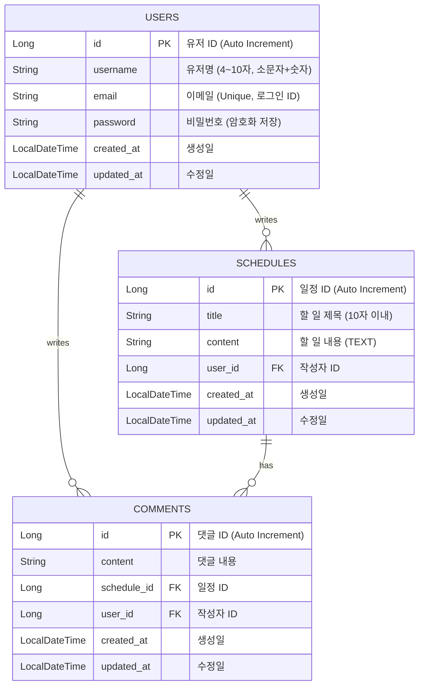

# 일정 관리 시스템 (Schedule Management System)

Spring Boot와 JPA를 활용하여 구축한 **일정 관리 REST API 서버**입니다.
단순한 CRUD 구현을 넘어, **세션 기반의 인증/인가**, **필터(Filter)를 활용한 보안 처리**, 그리고 **전역 예외 처리(Global Exception Handling)**를 통해 견고한 백엔드 아키텍처를 구현하는 데 초점을 맞추었습니다.

---

## Tech Stack

| Category | Technology |
| :--- | :--- |
| **Language** | Java 17 |
| **Framework** | Spring Boot 3.x |
| **Database** | MySQL 8.0 (Local), H2 (Test) |
| **ORM** | Spring Data JPA (Hibernate) |
| **Build Tool** | Gradle |
| **Security** | Custom Filter, HttpSession, BCrypt (Password) |
| **Util** | Lombok, Jackson |

---

## ERD (Entity Relationship Diagram)

본 프로젝트는 단방향 연관관계(Many-To-One)를 원칙으로 설계되었습니다.
객체지향적인 설계를 위해 모든 연관관계의 주인은 자식 엔티티(`Schedule`, `Comment`)이며, 물리적 외래키(FK) 제약조건을 준수합니다.



---

## Key Features & Implementation

### 1. 3-Layer Architecture & DTO Pattern

* **계층 분리**: `Controller` → `Service` → `Repository`의 역할과 책임을 명확히 분리했습니다.
* **DTO 사용**: 엔티티(Entity)가 API 응답으로 노출되는 것을 방지하고, 순환 참조 문제를 해결하기 위해 요청/응답 시 반드시 DTO(Data Transfer Object)를 사용합니다.

### 2. Custom Security (Filter & Session)

* **LoginFilter 구현**: `Filter` 인터페이스를 구현하여 요청이 `DispatcherServlet`에 도달하기 전, 인증 여부를 검사합니다.
* **WhiteList 관리**: 로그인/회원가입 등 인증이 불필요한 경로는 `PatternMatchUtils`를 사용하여 제외 처리했습니다.
* **JSON Response for 401**: 필터에서 인증 실패 시, 단순 `sendError`가 아닌 **JSON 포맷의 에러 응답**을 직접 작성하여 클라이언트가 파싱하기 쉽도록 개선했습니다.

### 3. Global Exception Handling

* **@RestControllerAdvice**: 예외 처리를 중앙 집중화하여 비즈니스 로직에서 `try-catch`를 제거했습니다.
* **표준 예외 응답**: 모든 에러 상황(400, 401, 404, 500)에서 동일한 포맷(`ErrorResponseDto`)의 JSON을 반환합니다.

### 4. JPA Performance Optimization

* **지연 로딩(Lazy Loading)**: `@ManyToOne(fetch = FetchType.LAZY)`를 기본으로 사용하여 불필요한 조인 쿼리(N+1 문제) 발생을 억제했습니다.
* **변경 감지(Dirty Checking)**: 데이터 수정 시 명시적인 `save()` 호출 없이, 트랜잭션 내에서 엔티티의 상태 변경만으로 DB 업데이트를 수행합니다.

---

## API Specification

| Domain | Method | URI | Description | Auth |
| --- | --- | --- | --- | --- |
| **User** | POST | `/api/users/signup` | 회원가입 | X |
|  | POST | `/api/users/login` | 로그인 (세션 발급) | X |
|  | POST | `/api/users/logout` | 로그아웃 (세션 만료) | O |
| **Schedule** | POST | `/api/schedules` | 일정 생성 | O |
|  | GET | `/api/schedules` | 일정 목록 조회 (Paging) | O |
|  | GET | `/api/schedules/{id}` | 일정 단건 조회 | O |
|  | PUT | `/api/schedules/{id}` | 일정 수정 (작성자 본인만) | O |
|  | DELETE | `/api/schedules/{id}` | 일정 삭제 (작성자 본인만) | O |
| **Comment** | POST | `/api/schedules/{id}/comments` | 댓글 생성 | O |
|  | GET | `/api/schedules/{id}/comments` | 댓글 목록 조회 | O |
|  | PUT | `/api/comments/{id}` | 댓글 수정 | O |
|  | DELETE | `/api/comments/{id}` | 댓글 삭제 | O |

---

## Constraints & Validation

데이터 무결성과 보안을 위해 다음과 같은 제약 조건을 `@Valid`와 정규식(Regex)을 통해 검증합니다.

### 1. 유저 (User)

* **Username**: 4~10자, 소문자 알파벳(`a-z`)과 숫자(`0-9`) 조합.
* **Password**: 8~15자, 대소문자/숫자/특수문자 포함 필수.
* **Email**: 표준 이메일 형식 준수 (`@` 포함).

### 2. 일정 (Schedule)

* **Title**: 필수 입력, 최대 10글자 제한.
* **Content**: 필수 입력, 글자 수 제한 없음 (`@Lob`).

### 3. 예외 응답 예시 (400 Bad Request)

유효성 검증 실패 시, 구체적인 원인을 포함하여 응답합니다.

```json
{
    "status": 400,
    "message": "입력값이 올바르지 않습니다.",
    "errors": {
        "username": "유저명은 4글자 이상이어야 합니다.",
        "email": "이메일 형식이 올바르지 않습니다."
    }
}

```
