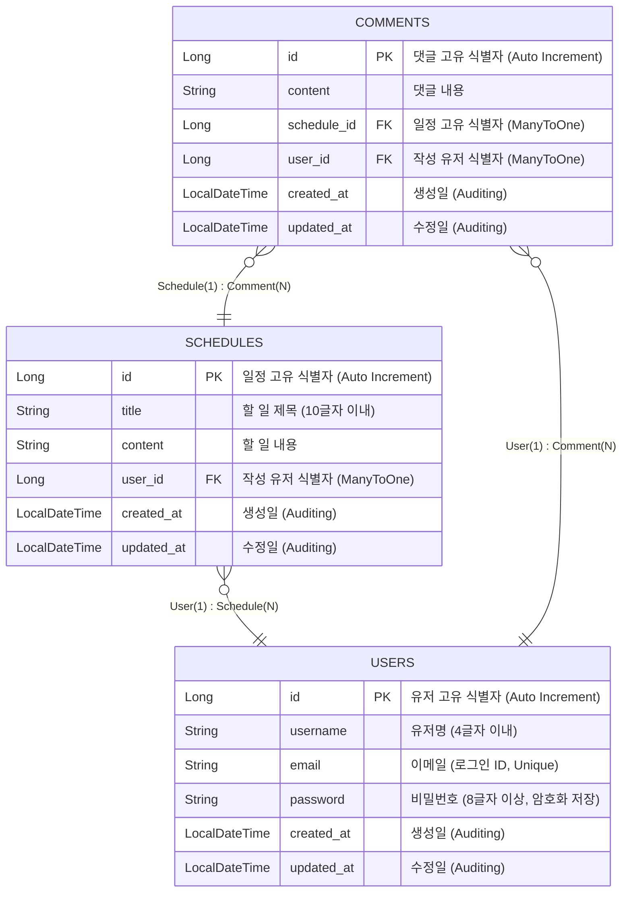

#  일정 관리 어플리케이션 (Schedule Management System)

Spring Boot와 JPA를 활용하여 일정 관리, 회원 가입/로그인, 댓글 기능을 구현한 RESTful API 서버입니다.  
**3-Layer Architecture**를 준수하며, **JPA 연관관계(단방향)**와 **세션 기반 인증/인가**를 핵심 학습 목표로 합니다.

---

## Tech Stack

- **Java**: 17+
- **Framework**: Spring Boot 3.x
- **Database**: MySQL (or H2 for local), JPA (Hibernate)
- **Security**: Cookie & Session (Custom Implementation), BCrypt (Password Encryption)
- **Build Tool**: Gradle

---

## ERD (Entity Relationship Diagram)

이 프로젝트는 단방향 연관관계(Many-To-One)를 원칙으로 설계되었습니다.  
모든 연관관계의 주인은 자식 엔티티(`Schedule`, `Comment`)이며, 부모 엔티티(`User`)는 자식을 참조하지 않습니다.

##  예외 처리 및 제약 사항 (Constraints & Validation)

본 프로젝트는 실제 상용 서비스 수준의 데이터 무결성과 보안을 위해 다음과 같은 제약 사항을 준수합니다.

### 1. 유저 (User)
- **유저명 (Username)**:
    - 최소 4자 이상, 10자 이하
    - **소문자 알파벳(`a-z`)과 숫자(`0-9`)**로만 구성되어야 함.
- **비밀번호 (Password)**:
    - 최소 8자 이상, 15자 이하
    - **알파벳(대소문자), 숫자, 특수문자**(`!@#$%^&*` 등)가 최소 1개씩 포함되어야 함.
- **이메일 (Email)**:
    - 올바른 이메일 형식을 지켜야 함 (`@` 포함, 도메인 형식).

### 2. 일정 (Schedule)
- **할 일 제목**: 필수 입력, 10글자 이내
- **할 일 내용**: 필수 입력, 글자 수 제한 없음 (Lob)

### 3. 공통 (Common)
- **연관관계**: 양방향 매핑을 지양하고 `@ManyToOne` 단방향 매핑을 원칙으로 함.
- **삭제 정책**: `Cascade` 옵션 사용을 지양하고, Service 계층에서 명시적으로 연관 데이터를 처리함.
- **예외 응답**: 검증 실패(Validation Fail) 시 `400 Bad Request`와 함께 구체적인 에러 메시지(JSON)를 반환함.